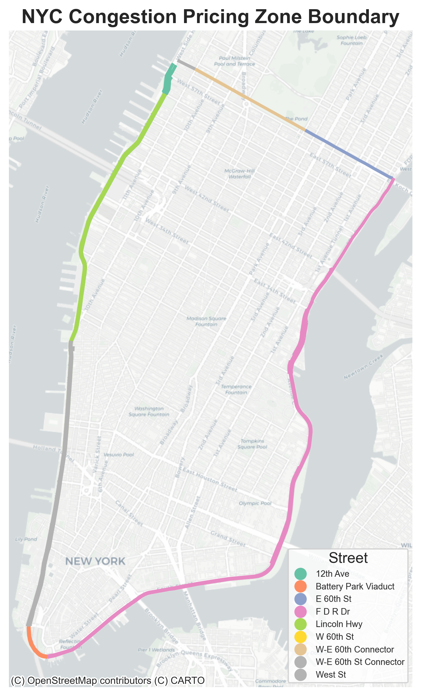
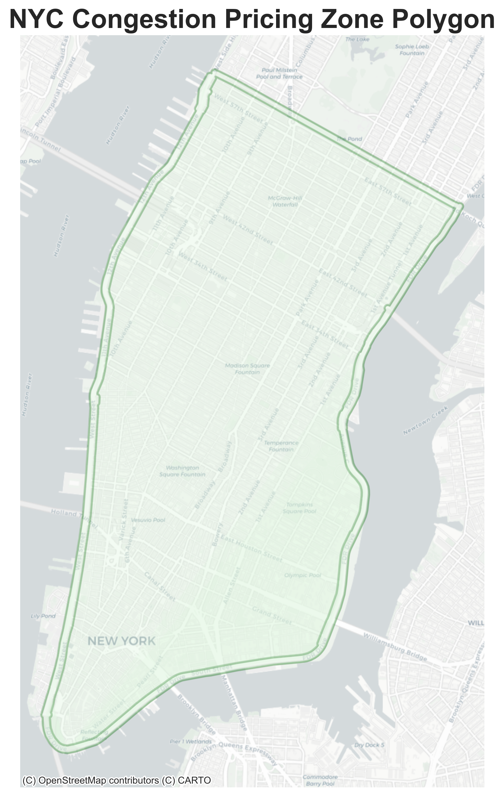
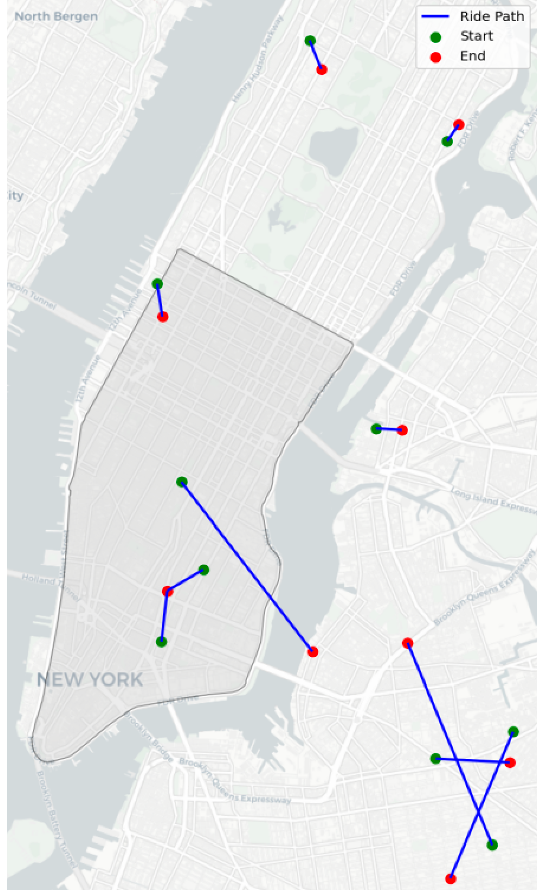
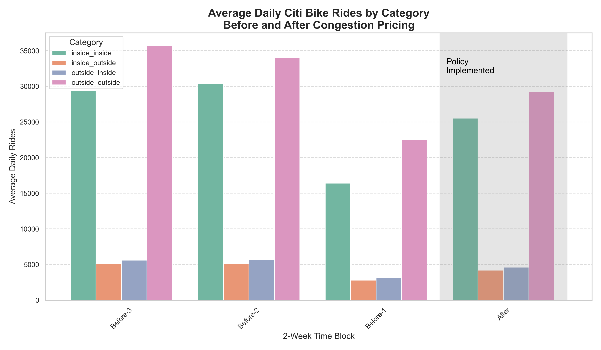
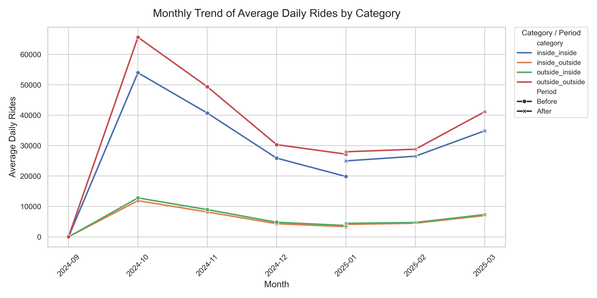

# Abstract
This analysis examines how the introduction of New York City’s congestion pricing policy in January 2025 influenced bike-share usage during peak commuting hours. By comparing Citi Bike data from the months before and after the policy took effect, notable shifts in ridership behavior were identified. The data shows a strong recovery in trips that started and ended within the congestion zone ("inside-inside" trips), while cross-boundary trips remained low. This suggests the policy encouraged more localized travel and discouraged longer, boundary-crossing journeys. Although winter weather contributed to a general decline in ridership, the strongest rebound occurred in intra-zone travel, signaling an opportunity to strengthen local cycling infrastructure.

# Background
In January 2025, New York City implemented the U.S.'s first congestion pricing program, imposing a $9–$23 fee for vehicles entering Manhattan below 60th Street. Designed to alleviate traffic, reduce emissions, and generate $15 billion for transit upgrades, the program has led to a 13% reduction in car traffic. Analyzing changes in bike ridership will provide critical insights into how commuters are shifting to cycling, informing strategic decisions for infrastructure development and policy optimization.

# Inputs
The analysis relies on two main datasets.[Citi Bike trip data](https://citibikenyc.com/system-data)  covering October 2024 through March 2025, includes detailed information on trip duration, user type, rideable type, and start/end station locations with geographic coordinates.To define the boundaries of the congestion pricing zone, shapefiles from the[TIGER census roads shapefile](https://www.census.gov/cgi-bin/geo/shapefiles/index.php?year=2021&layergroup=Roads) was used. 

This six-month period captures three months before and three months after the congestion pricing policy began on January 5, 2025. This time window allows for both seasonal trend analysis and the identification of changes likely caused by the new policy.

# Scripts
Five Python scripts are used for this project and should be run in the order that they are listed below.

### 1. import_rides.py
The first script is used to import zip files containing Citi Bike ride data for each month. Each month’s zip file includes multiple CSV files, which are then read into individual dataframes using the pandas module. These dataframes are merged into a single dataset and saved as a .pkl file (merged_citibike_tripdata.pkl) using pandas for efficient storage. This file format is chosen due to the large size of the data, which makes it more efficient to store and load compared to other formats.

### 2. make_boundary.py
The second script reads the roads shapefile using GeoPandas.It then processes the roads data to define the boundary for the congestion pricing zone. After creating the boundary, the script exports the resulting data to a GeoPackage format and saves it as "nyc-congestion-boundary.gpkg" for further use.

### 3. make_poly.py
The third script converts a line-based congestion pricing boundary into a polygon to enable spatial analysis. It reads the boundary from a GeoPackage (nyc-congestion-boundary.gpkg), merges individual line segments into a continuous geometry, and constructs a closed polygon using geometric operations. The resulting polygon, representing the full congestion zone, is saved as a new GeoPackage (nyc-congestion.gpkg) for use in spatial joins, filtering trips, or mapping areas impacted by congestion pricing.

### 4. categorize_rides
The fourth script filters Citi Bike data for peak-hour trips, segments them into pre- and post-congestion pricing periods, and checks if ride locations fall within the congestion zone. Each ride is categorized based on its start and end points relative to the zone:

* Inside-Inside: Ride starts and ends within the congestion zone.

* Outside-Outside: Ride starts and ends outside the congestion zone.

* Inside-Outside: Ride starts within the zone but ends outside.

* Outside-Inside: Ride starts outside the zone but ends within.

The categorized data is saved as pickle files (before_congestion_categorized.pkl and after_congestion_categorized.pkl) for efficient storage and faster access in future analyses.

### 5. analyze_rides

To isolate the immediate impact of the **January 5, 2025** congestion pricing rollout, ride data was segmented into two-week blocks. This structure enables clear, time-bound comparisons while minimizing holiday-related distortions.

**Post-policy block:**
- **Jan 5–18, 2025**: Captures immediate behavioral response.

**Pre-policy blocks:**
1. **Dec 22, 2024 – Jan 4, 2025**: Directly preceding the policy launch.
2. **Dec 8–21, 2024**: Avoids major holidays, offering a clean baseline.
3. **Nov 24 – Dec 7, 2024**: Adds stability and context to pre-policy trends.

In the fifth script, I calculated average rides by category for each block to detect short-term shifts attributable to the policy.

In addition to this block-level view, I also conducted a **monthly analysis** to assess broader trends and seasonal patterns across the full **October 2024 to March 2025** window.

# Methodology 

### Step 1
The congestion pricing zone was defined by line segments from the TIGER census roads shapefile for New York County.

### Step 2
These segments were converted into a polygon, which was then overlaid with Citi Bike trip data.

### Step 3
Next, a spatial join is performed to link the ride start and end locations with the congestion pricing zone polygon. This spatial operation classifies each trip into one of four categories based on its spatial relationship to the congestion pricing zone. The image provided is a sample illustrating this process and not found in the repository.

# Findings
## 1. Short-Term Impact: 2-Week Blocks Analysis

This figure shows the 2 Week Block Average Daily Rides by Category.

### Observations:
Immediately before the policy launch, a decline in all trip categories was observed—likely due to seasonal or holiday effects. Following the policy’s introduction, "inside-inside" trips rebounded sharply. "Outside-outside" trips remained relatively stable but showed a slight decline. In contrast, cross-boundary trips ("inside-outside" and "outside-inside") remained suppressed. These findings indicate a behavioral shift toward shorter, localized travel and reduced demand for cross-zone cycling.

## 2. Long-Term Trend: Monthly Analysis

This figure shows the Monthly Trend of Average Daily Rides by Category.

### Observations:
October marked a peak in bike usage across all categories. A seasonal decline followed through the winter months. After the policy took effect in January, "inside-inside" and "outside-outside" rides showed gradual recovery through March. Cross-zone trips continued to lag, further supporting the conclusion that congestion pricing incentivized localized trips while discouraging boundary crossings.

# Limitations
1. Weather Not Accounted For: Weather factors, such as temperature and precipitation, are not considered, which may influence bike ridership patterns.

2. Private Bike Rides Not Included: This study only considers Citi Bike data, excluding rides on private bicycles, which could impact overall ridership trends.

3. Short Data Period: The analysis covers only three months before and after the January 2025 congestion pricing policy, limiting the ability to assess long-term effects.